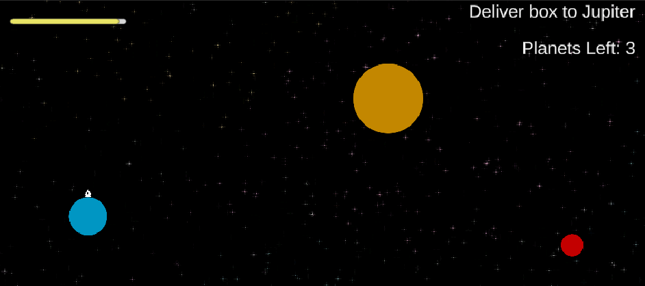

# AmaGon Prime
Developed by Cooper Waite and David Ban, Music and SFX by Euan Tandiono for [GDD](https://www.gamedesigndecal.com/).

Total time given for the game: 1 week
 

## Gameplay
AmaGon has just started their inter-planetary delivery system. Your job is to successfully deliver packages to Jupiter, or Mars, without running out of fuel. Use 'A' and 'D' to rotate the ship, and space bar to accelerate. Press J to drop a package, which retains the velocity of the ship. But be careful, as moving off screen means you'll have to find your way back without any help.

